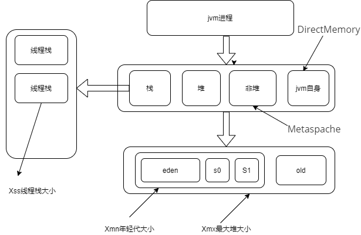
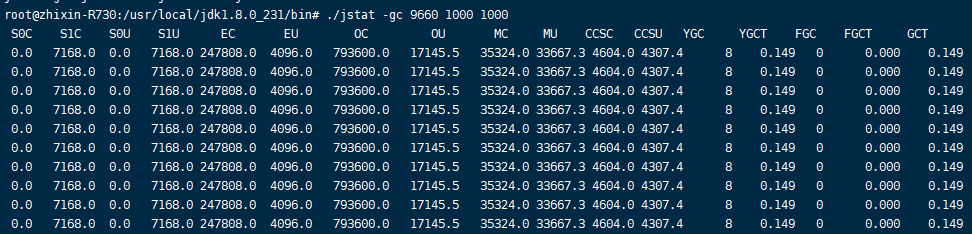

作业：

## class1：

2、自定义一个 Classloader，加载一个 Hello.xlass 文件，执行 hello 方法， 

此文件内容是一个 Hello.class 文件所有字节（x=255-x）处理后的文件。文件群里提供。

```
import javax.annotation.Resources;
import java.io.*;
import java.lang.reflect.Method;
import java.net.URL;

public class HelloClassLoader extends ClassLoader {

    public  static void main(String[] args) {
        try {
            Class o = new HelloClassLoader().findClass("Hello");
            Method method = o.getMethod("hello");
            method.invoke(o.newInstance());
        }catch (Exception e){
            e.printStackTrace();
        }
    }

    @Override
    protected Class<?> findClass(String name) throws ClassNotFoundException {

        File file = new File("./" + name + ".xlass");
        byte[] bytes = fileToBytes(file);
        for (int i = 0; i < bytes.length; i++){
            bytes[i] = (byte) (255 - (int) bytes[i]);
        }

        return defineClass(name, bytes, 0, bytes.length);
    }

    public static byte[] fileToBytes(File file) {
        byte[] bytes = null;

        FileInputStream fis = null;
        ByteArrayOutputStream bos = null;

        try{
            fis = new FileInputStream(file);
            bos = new ByteArrayOutputStream();
            byte[] b = new byte[1024];
            int n;
            while ((n = fis.read(b)) != -1)
            {
                bos.write(b, 0, n);
            }
            bytes = bos.toByteArray();

        } catch (FileNotFoundException e) {
            e.printStackTrace();
        } catch (IOException e) {
            e.printStackTrace();
        } finally {
            try {
                fis.close();
                bos.close();
            } catch (IOException e) {
                e.printStackTrace();
            }
        }

        return bytes;
    }
}

```

3、画一张图，展示 Xmx、Xms、Xmn、Metaspache、DirectMemory、Xss

这些内存参数的关系。



## class2：

1、本机使用 G1 GC 启动一个程序，仿照课上案例分析一下 JVM 情况 

可以使用gateway-server-0.0.1-SNAPSHOT.jar 

注意关闭自适应参数：-XX:-UseAdaptiveSizePolicy 



